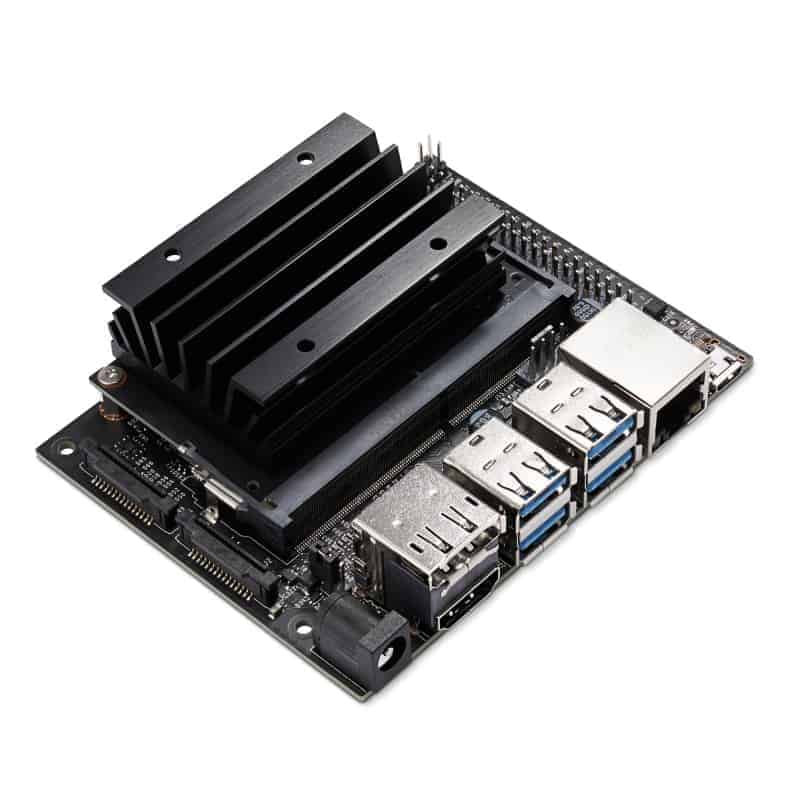
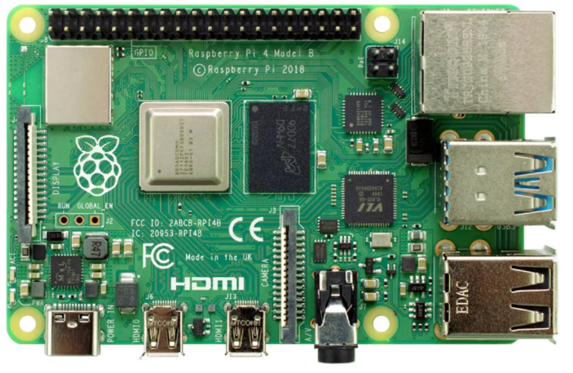
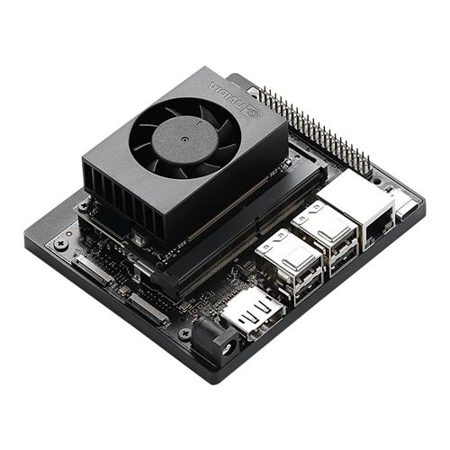

[Electrical Components](../ElectricalComponents.md)

- [Compute](#compute)
- [Compute: SparkFun Edge Development Board](#compute-sparkfun-edge-development-board)
- [Nvidia Jetson Nano Dev Kit](#nvidia-jetson-nano-dev-kit)
- [Raspberry Pi 4 Model B](#raspberry-pi-4-model-b)
- [Nvidia Jetson Orin Nano Dev Kit](#nvidia-jetson-orin-nano-dev-kit)

# Compute

# Compute: SparkFun Edge Development Board

[Reference](https://www.sparkfun.com/sparkfun-edge-development-board-apollo3-blue.html?srsltid=AfmBOoq1JqFYPNGZ8G4FSOvoIjT04y0p-Y19JzuHqAZDhBzCZ258r1BH)

# [Nvidia Jetson Nano Dev Kit](NvidiaJetsonNanoDevKit/NvidiaJetsonNanoDevKit.md)

# [Raspberry Pi 4 Model B](RaspberryPi4ModelB/RaspberryPi4ModelB.md)

# [Nvidia Jetson Orin Nano Dev Kit](NvidiaJetsonOrinNanoDevKit/NvidiaJetsonOrinNanoDevKit.md)
