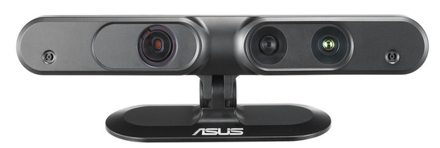

[Camera Sensors](../CameraSensors.md)

# Asus Xtion Camera


## Setup
```bash
sudo apt install ros-noetic-openni2-camera ros-noetic-openni2-launch ros-noetic-rgbd-launch
sudo apt install libopenni2-dev
sudo service udev reload
sudo service udev restart
roslaunch openni2_launch openni2.launch depth_registration:=true
```