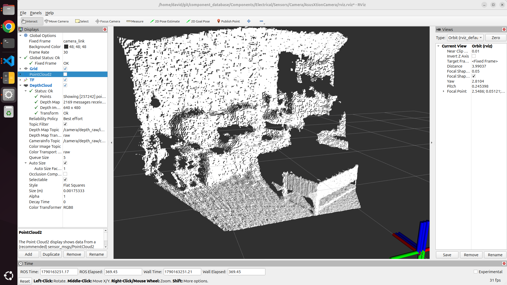
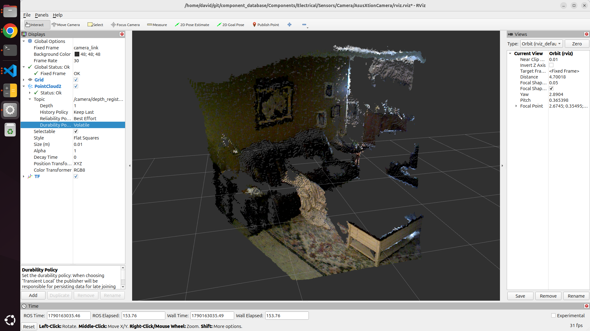

[Camera Sensors](../CameraSensors.md)

# Asus Xtion Camera


## Setup

```
sudo apt update
sudo apt install ros-jazzy-openni2-camera
sudo apt install libopenni2-dev
ros2 launch openni2_camera camera_with_cloud.launch.py
ros2 run rviz2 rviz2
```

## Depth Image


## Depth w/ Camera Image


## Topic List
```bash
/camera/depth/camera_info [sensor_msgs/msg/CameraInfo]
/camera/depth_raw/camera_info [sensor_msgs/msg/CameraInfo]
/camera/depth_raw/image [sensor_msgs/msg/Image]
/camera/depth_registered/image_raw [sensor_msgs/msg/Image]
/camera/depth_registered/points [sensor_msgs/msg/PointCloud2]
/camera/ir/camera_info [sensor_msgs/msg/CameraInfo]
/camera/ir/image_raw [sensor_msgs/msg/Image]
/camera/projector/camera_info [sensor_msgs/msg/CameraInfo]
/camera/rgb/camera_info [sensor_msgs/msg/CameraInfo]
/camera/rgb/image_raw [sensor_msgs/msg/Image]
/parameter_events [rcl_interfaces/msg/ParameterEvent]
/rosout [rcl_interfaces/msg/Log]
/tf_static [tf2_msgs/msg/TFMessage]
```