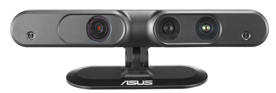
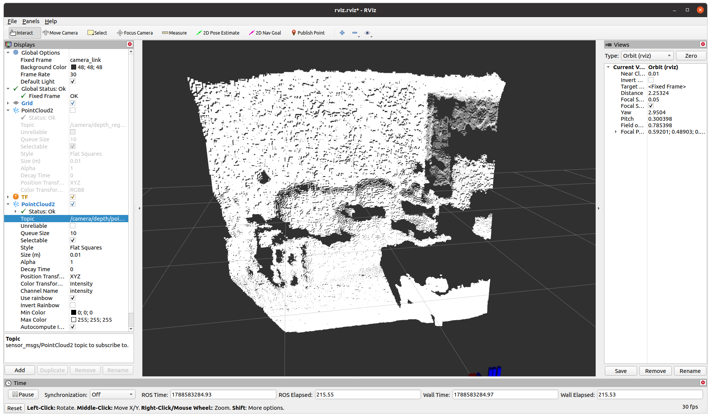
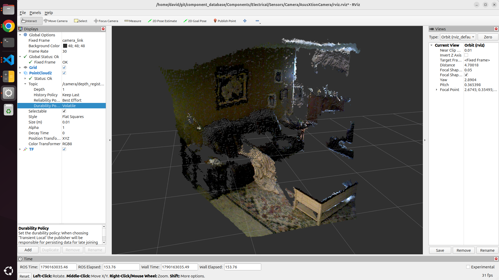

[Camera Sensors](../CameraSensors.md)

# Asus Xtion Camera


## Setup

```
sudo apt update
sudo apt install ros-jazzy-openni2-camera
sudo apt install libopenni2-dev
ros2 launch openni2_camera camera_with_cloud.launch.py
ros2 run rviz2 rviz2
```

## Configuration

| Mode  | Resolution Name            | Pixel Dimensions | Frame Rate | Primary Operational Impact                                                                       |
| :---: | :------------------------- | :--------------: | :--------: | :----------------------------------------------------------------------------------------------- |
| **1** | **SXGA (Color Only)**      |   1280 × 1024    |   30 FPS   | Disables hardware depth alignment; used strictly for high-res color tracking.                    |
| **2** | **QVGA (Low Footprint)**   |  **320 × 240**   | **30 FPS** | **The Fix:** Slices point data throughput by **75%**, eliminating the USB writeout queue backup. |
| **3** | **QVGA (High Speed)**      |    320 × 240     |   60 FPS   | Lowers per-frame memory load but spikes Jetson CPU core usage due to the rapid 60Hz loop.        |
| **4** | **SXGA / VGA (Slow)**      |   1280 × 1024    |   15 FPS   | Halves frequency to 15Hz; provides sharp spatial maps for slow-moving robotics.                  |
| **5** | **VGA (Standard Default)** |  **640 × 480**   | **30 FPS** | **The Bottleneck:** Floods the shared USB controller with **307,200 points per frame** at 30Hz.  |

## Depth Image


## Depth w/ Camera Image


## Topic List
```bash
/camera/depth/camera_info [sensor_msgs/msg/CameraInfo]
/camera/depth_raw/camera_info [sensor_msgs/msg/CameraInfo]
/camera/depth_raw/image [sensor_msgs/msg/Image]
/camera/depth_registered/image_raw [sensor_msgs/msg/Image]
/camera/depth_registered/points [sensor_msgs/msg/PointCloud2]
/camera/ir/camera_info [sensor_msgs/msg/CameraInfo]
/camera/ir/image_raw [sensor_msgs/msg/Image]
/camera/projector/camera_info [sensor_msgs/msg/CameraInfo]
/camera/rgb/camera_info [sensor_msgs/msg/CameraInfo]
/camera/rgb/image_raw [sensor_msgs/msg/Image]
/parameter_events [rcl_interfaces/msg/ParameterEvent]
/rosout [rcl_interfaces/msg/Log]
/tf_static [tf2_msgs/msg/TFMessage]
```

## Troubleshooting
### Issue: No Camera Stream
See output of launch like this:
```text
[component_container-1] [INFO] [1791138294.404840357] [robot.camera.driver]: No matching device found.... waiting for devices. Reason: openni2_wrapper::OpenNI2Device::OpenNI2Device(const std::string&, rclcpp::Node*) @ ./src/openni2_device.cpp @ 76 : Device open failed
[component_container-1] 	Could not open "1d27/0601@1/4": USB transfer timeout!
```

**Resolution**
1. Install the utility if you don't have it
sudo apt install usbutils

2. Find the exact Bus and Device number for ID 1d27:0601
lsusb | grep -i "1d27"

Example output: Bus 001 Device 004: ID 1d27:0601 ASUS)

1. Force a physical reset on that specific hub slot (replace with your Bus/Dev numbers)
sudo usbreset /dev/bus/usb/001/004