IMU Covariance Analysis Report: IMU_Sparkfun_183F
=================================================

Table of Contents
=================

* [Overview](#overview)
	* [IMU Parameters](#imu-parameters)
* [IMU Analysis](#imu-analysis)
	* [Orientation Analysis](#orientation-analysis)
	* [Gyroscope Analysis](#gyroscope-analysis)
	* [Linear Acceleration Analysis](#linear-acceleration-analysis)
* [IMU Magnetometer Analysis](#imu-magnetometer-analysis)
	* [Magnetometer Analysis](#magnetometer-analysis)

# Overview

Generated on: 2026-08-02 06:48:50

This report provides an analysis of the IMU data, including covariance matrices for orientation, gyroscope, linear acceleration, and magnetometer data. The analysis is based on the provided CSV files containing IMU and magnetic field data.
## IMU Parameters

- name: `IMU_Sparkfun_183F`

- device_name: `/dev/imu_SparkFun_183F`

- description: `Sparkfun 9DoF Razor IMU (MPU-9250)`

- manufacturer: `Sparkfun`

- full_serial_number: `D3CF0EEF514E325437202020FF13183F`
# IMU Analysis

IMU Message Count: 290453

IMU Data Duration: 3635.59 seconds

IMU Data Average Frequency: 79.89 Hz
## Orientation Analysis

Orientation Roll Average: -3.13834778 (rad) Standard Deviation: 0.05332737

Orientation Pitch Average: -0.00141028 (rad) Standard Deviation: 0.01191764

Orientation Yaw Average: -1.25994240 (rad) Standard Deviation: 0.07701107

Orientation Covariance Matrix:
$$
\begin{bmatrix}
0.0028438178612961 & -0.0001024180710413 & 0.0001507695892352 \\
-0.0001024180710413 & 0.0001420305878033 & -0.0000360170336051 \\
0.0001507695892352 & -0.0000360170336051 & 0.0059307247806398 \\
\end{bmatrix}
$$

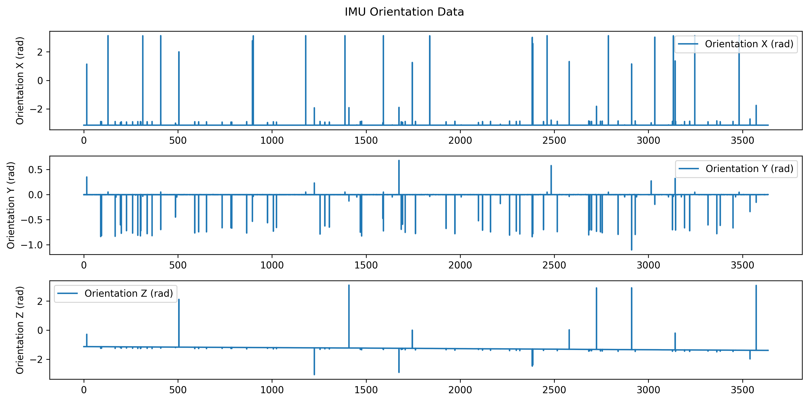

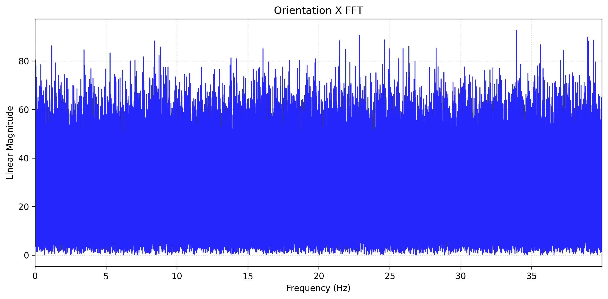

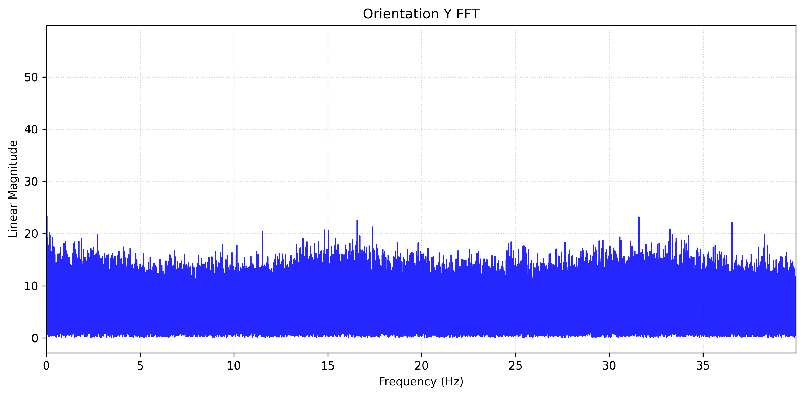

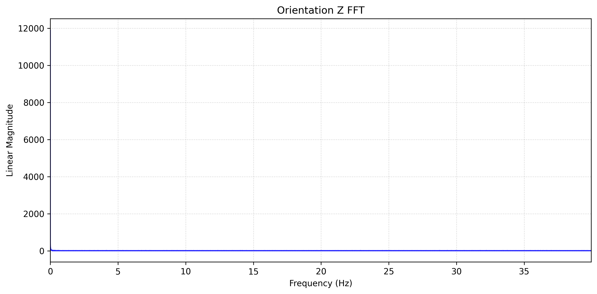
## Gyroscope Analysis

Gyroscope X Average: -0.00216296 (rad/s) Standard Deviation: 1.33318442

Gyroscope Y Average: -0.00696537 (rad/s) Standard Deviation: 1.39871228

Gyroscope Z Average: -0.00146084 (rad/s) Standard Deviation: 1.49202945

Gyroscope Covariance Matrix:
$$
\begin{bmatrix}
1.7773868183007324 & -0.0408769670827739 & -0.1042825195400728 \\
-0.0408769670827739 & 1.9564027797914891 & 0.0307106242381175 \\
-0.1042825195400728 & 0.0307106242381175 & 2.2261595516607438 \\
\end{bmatrix}
$$

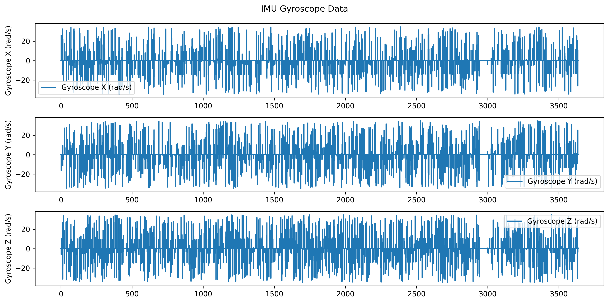

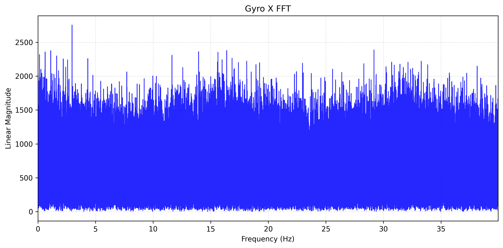

## Linear Acceleration Analysis

Linear Acceleration X Average: 0.01901286 (m/s^2) Standard Deviation: 0.45204580

Linear Acceleration Y Average: -0.00224468 (m/s^2) Standard Deviation: 0.60838353

Linear Acceleration Z Average: -9.88933572 (m/s^2) Standard Deviation: 0.96099765

Linear Acceleration Covariance Matrix:
$$
\begin{bmatrix}
0.2043461120981339 & -0.0125031827520920 & -0.0586203384253612 \\
-0.0125031827520920 & 0.3701317940901653 & -0.0243474090107838 \\
-0.0586203384253612 & -0.0243474090107838 & 0.9235196624630425 \\
\end{bmatrix}
$$

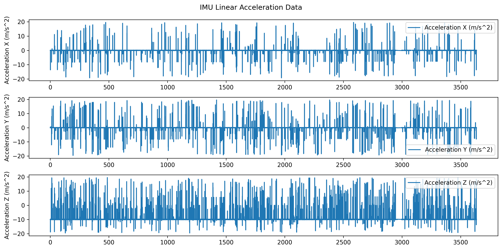

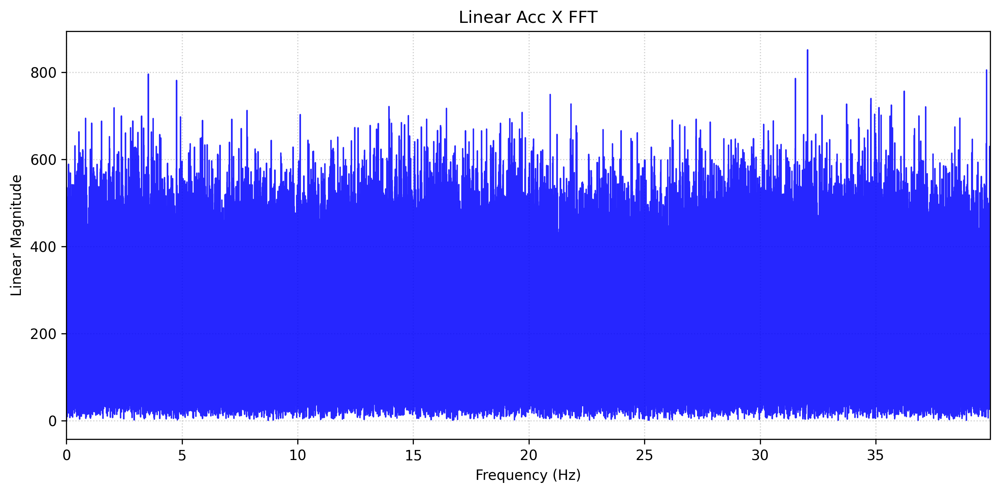

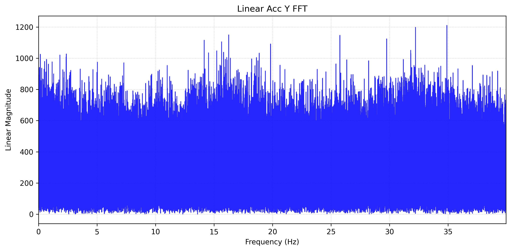

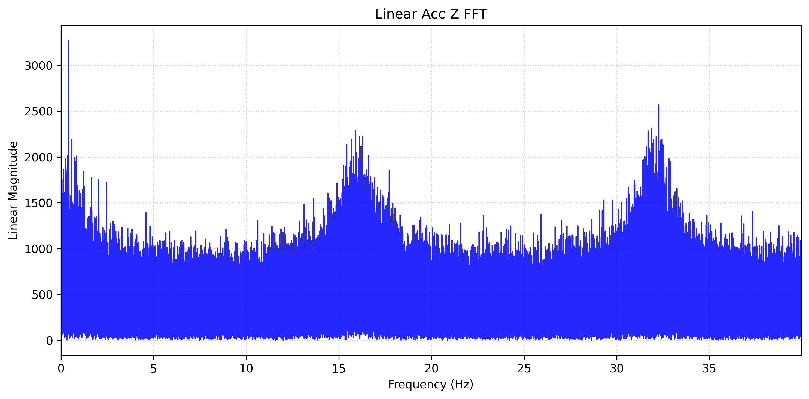
# IMU Magnetometer Analysis

Magnetic Data Message Count: 292632

Magnetic Data Duration: 3635.45 seconds

Magnetic Data Average Frequency: 80.49 Hz
## Magnetometer Analysis

Magnetometer X Average: 33.19205579 (T) Standard Deviation: 0.74898000

Magnetometer Y Average: 12.44128598 (T) Standard Deviation: 0.75621972

Magnetometer Z Average: -77.83428637 (T) Standard Deviation: 0.72690908

Magnetometer Covariance Matrix:
$$
\begin{bmatrix}
0.5609729541886166 & -0.0039015611297877 & -0.0210882082235615 \\
-0.0039015611297877 & 0.5718702196916625 & -0.0222064742012597 \\
-0.0210882082235615 & -0.0222064742012597 & 0.5283986186471780 \\
\end{bmatrix}
$$

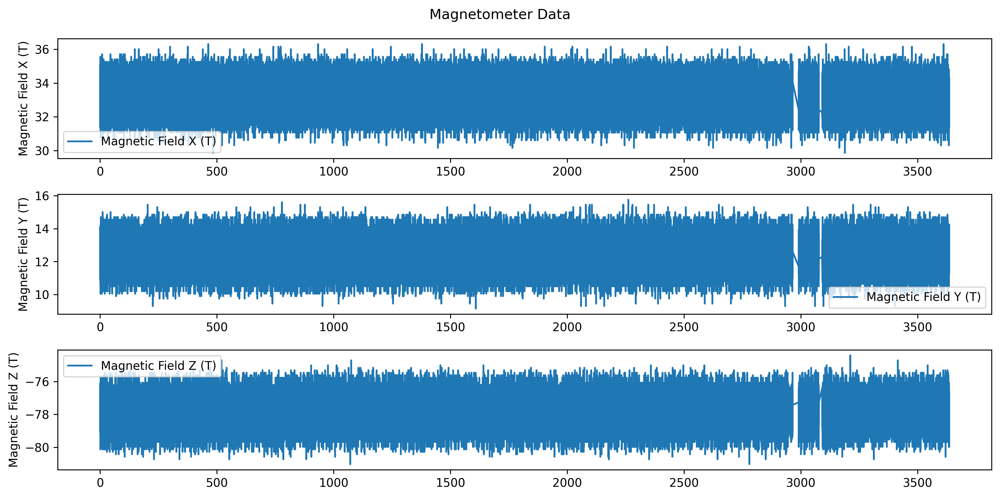

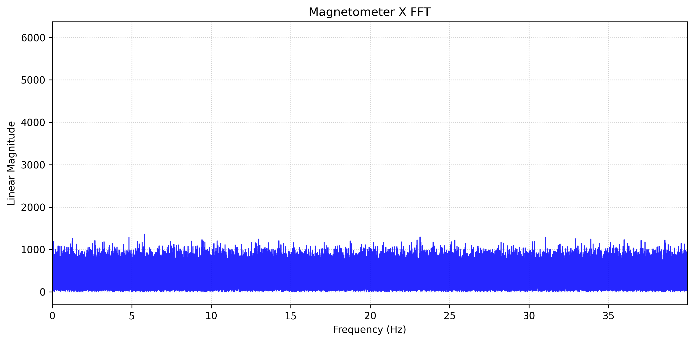

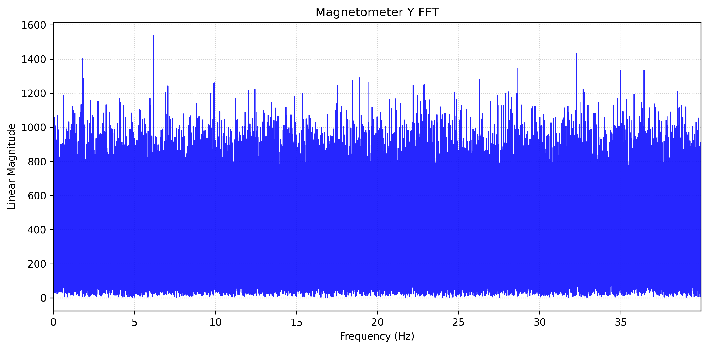

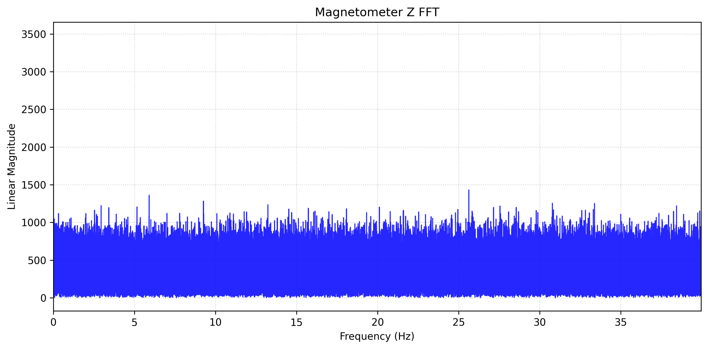