IMU Covariance Analysis Report: IMU_Sparkfun_2115
=================================================

Table of Contents
=================

* [Overview](#overview)
	* [IMU Parameters](#imu-parameters)
* [IMU Analysis](#imu-analysis)
	* [Orientation Analysis](#orientation-analysis)
	* [Gyroscope Analysis](#gyroscope-analysis)
	* [Linear Acceleration Analysis](#linear-acceleration-analysis)
* [IMU Magnetometer Analysis](#imu-magnetometer-analysis)
	* [Magnetometer Analysis](#magnetometer-analysis)

# Overview

Generated on: 2026-08-02 06:50:36

This report provides an analysis of the IMU data, including covariance matrices for orientation, gyroscope, linear acceleration, and magnetometer data. The analysis is based on the provided CSV files containing IMU and magnetic field data.
## IMU Parameters

- name: `IMU_Sparkfun_2115`

- device_name: `/dev/imu_SparkFun_2115`

- description: `Sparkfun 9DoF Razor IMU (MPU-9250)`

- manufacturer: `Sparkfun`

- full_serial_number: `A354B24F514E3254374A2020FF062115`
# IMU Analysis

IMU Message Count: 318839

IMU Data Duration: 3711.65 seconds

IMU Data Average Frequency: 85.90 Hz
## Orientation Analysis

Orientation Roll Average: -3.13081576 (rad) Standard Deviation: 0.07887279

Orientation Pitch Average: 0.00390500 (rad) Standard Deviation: 0.00554093

Orientation Yaw Average: 0.17049908 (rad) Standard Deviation: 0.08839093

Orientation Covariance Matrix:
$$
\begin{bmatrix}
0.0062209365989094 & -0.0001976191353483 & -0.0015209139240192 \\
-0.0001976191353483 & 0.0000307020180164 & -0.0000064996684289 \\
-0.0015209139240192 & -0.0000064996684289 & 0.0078129816848510 \\
\end{bmatrix}
$$

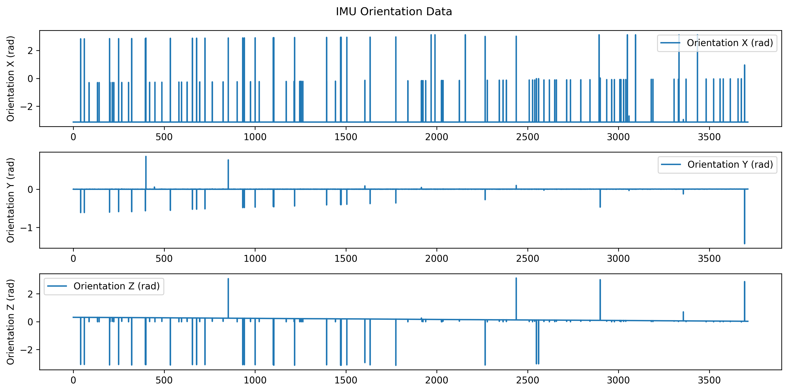

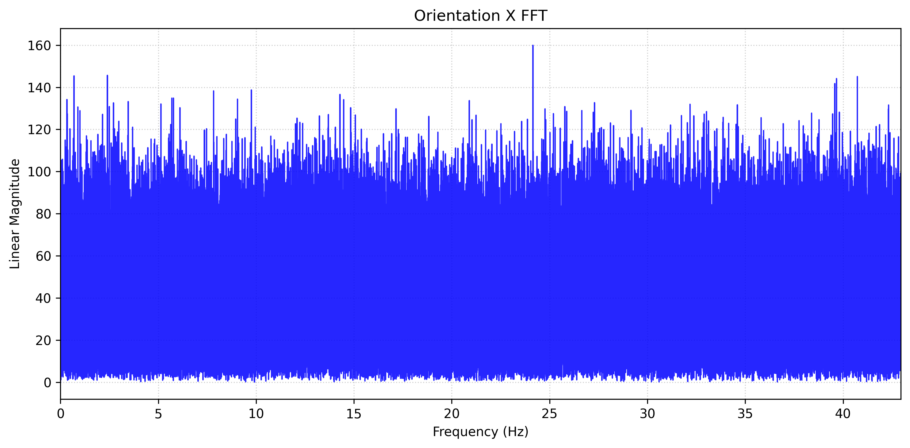

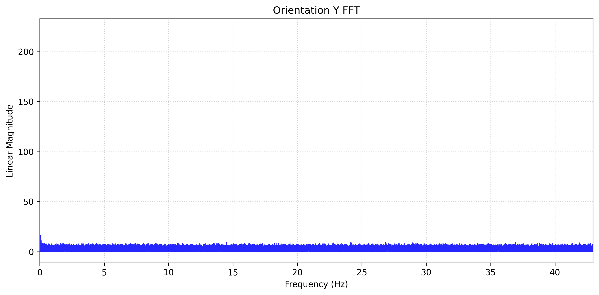

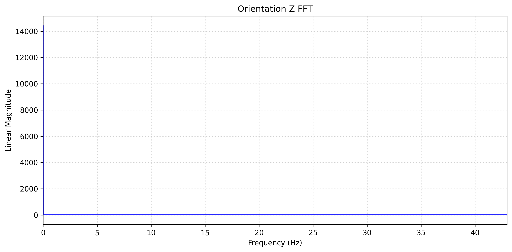
## Gyroscope Analysis

Gyroscope X Average: 0.01277003 (rad/s) Standard Deviation: 0.90510680

Gyroscope Y Average: 0.01033266 (rad/s) Standard Deviation: 0.99481895

Gyroscope Z Average: 0.01313185 (rad/s) Standard Deviation: 1.09942621

Gyroscope Covariance Matrix:
$$
\begin{bmatrix}
0.8192208897751221 & -0.0274445283653816 & -0.0139653658559974 \\
-0.0274445283653816 & 0.9896678519963757 & -0.0024537845588209 \\
-0.0139653658559974 & -0.0024537845588209 & 1.2087417850623245 \\
\end{bmatrix}
$$

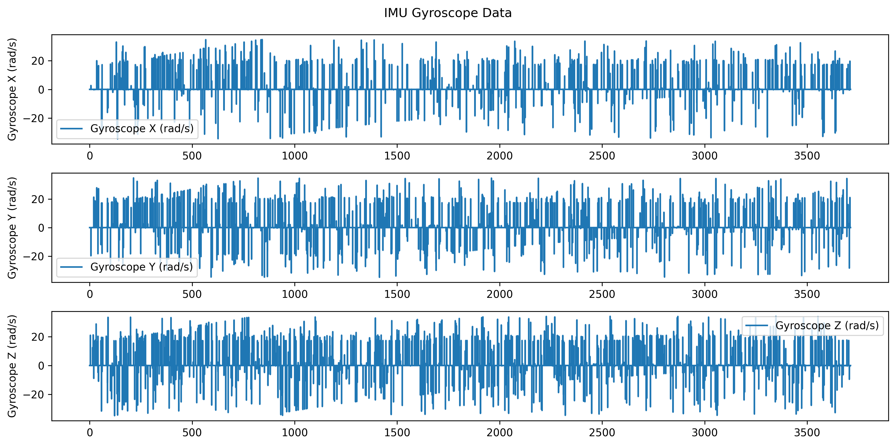

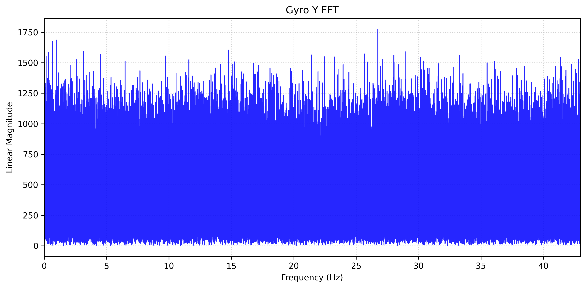

## Linear Acceleration Analysis

Linear Acceleration X Average: -0.03213367 (m/s^2) Standard Deviation: 0.22045219

Linear Acceleration Y Average: 0.09614409 (m/s^2) Standard Deviation: 0.36407863

Linear Acceleration Z Average: -10.26221645 (m/s^2) Standard Deviation: 0.67098707

Linear Acceleration Covariance Matrix:
$$
\begin{bmatrix}
0.0485993219355605 & 0.0009438857243738 & 0.0246966594456194 \\
0.0009438857243738 & 0.1325536616089849 & 0.0213074418797649 \\
0.0246966594456194 & 0.0213074418797649 & 0.4502250645569160 \\
\end{bmatrix}
$$

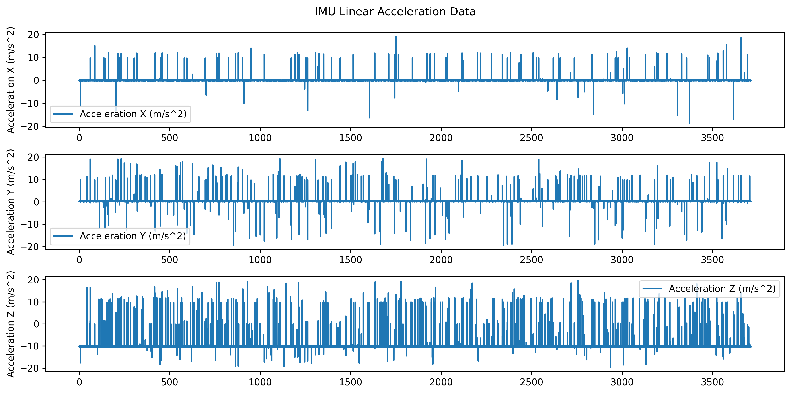

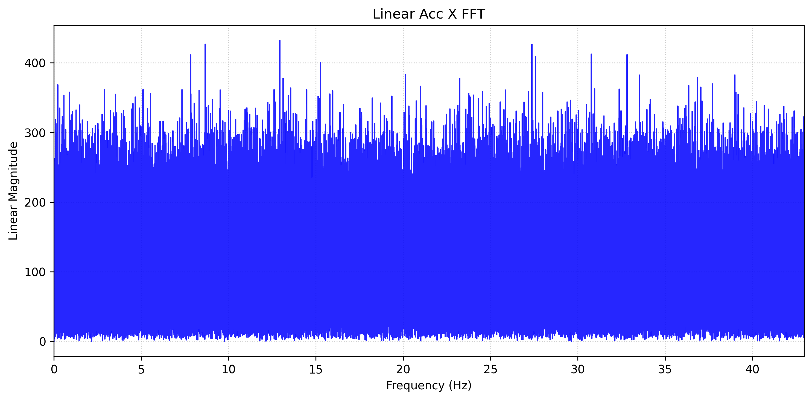

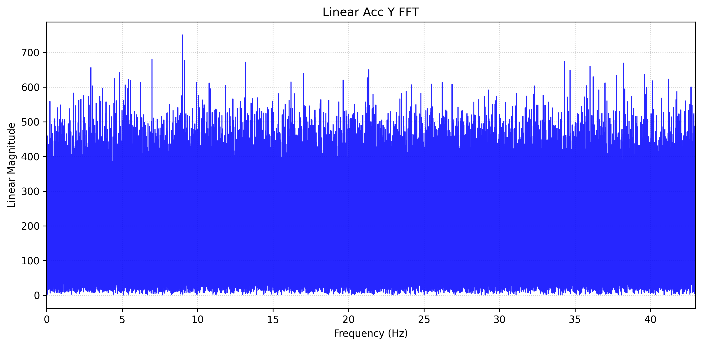

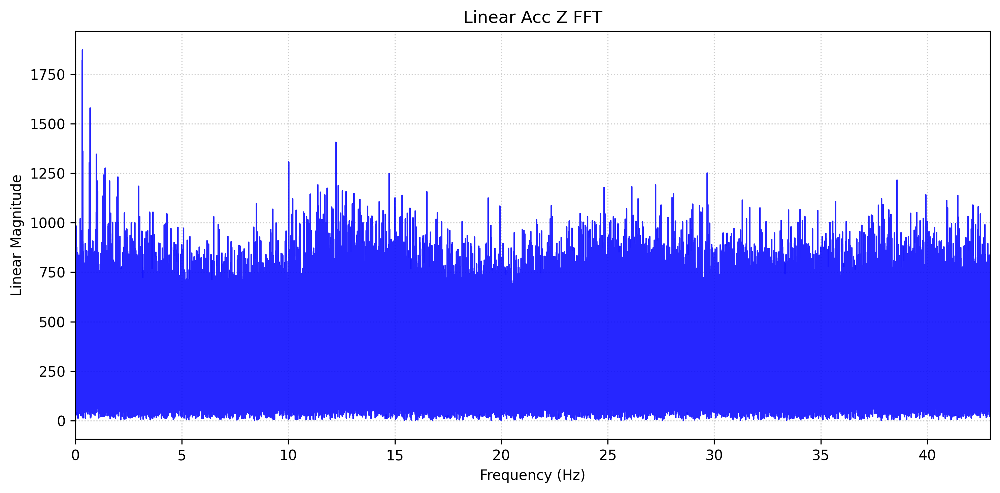
# IMU Magnetometer Analysis

Magnetic Data Message Count: 318838

Magnetic Data Duration: 3711.64 seconds

Magnetic Data Average Frequency: 85.90 Hz
## Magnetometer Analysis

Magnetometer X Average: 2.79403757 (T) Standard Deviation: 0.76321235

Magnetometer Y Average: 23.39326059 (T) Standard Deviation: 0.77239689

Magnetometer Z Average: -131.90127507 (T) Standard Deviation: 0.75263080

Magnetometer Covariance Matrix:
$$
\begin{bmatrix}
0.5824949194040040 & 0.0011825322802961 & 0.0046666165870322 \\
0.0011825322802961 & 0.5965988316620018 & 0.0006160391054542 \\
0.0046666165870322 & 0.0006160391054542 & 0.5664548964957726 \\
\end{bmatrix}
$$

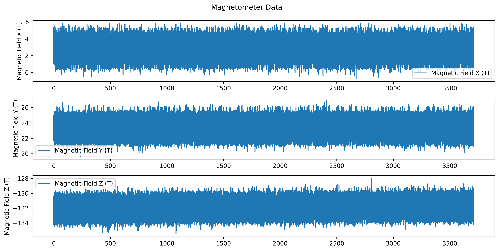

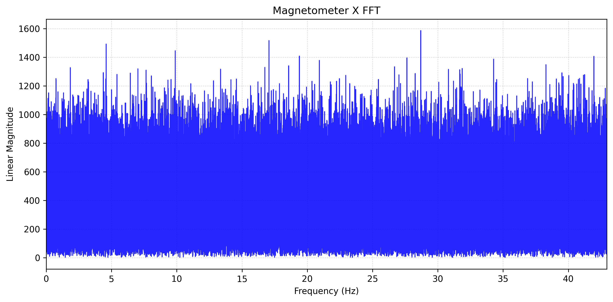

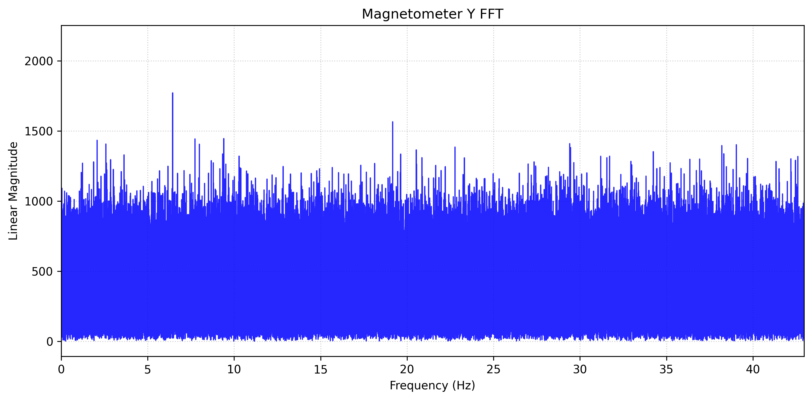

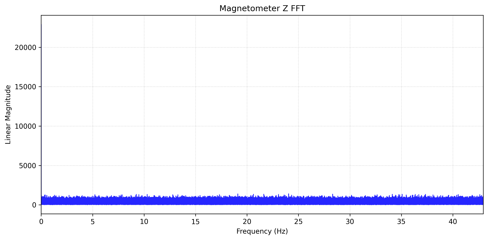