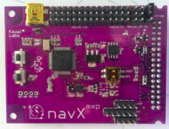
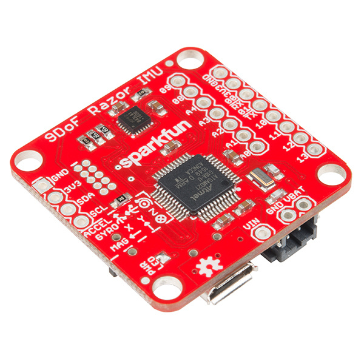
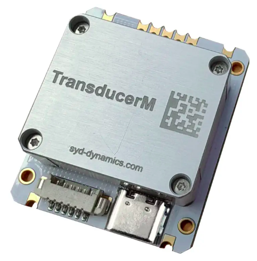

[Sensors](../Sensors.md)

- [Inertial Sensors](#inertial-sensors)
  - [ToDo](#todo)
- [Sensors to Consider:](#sensors-to-consider)
- [Sensor: NavX MXP IMU](#sensor-navx-mxp-imu)
- [Sensor: Sparkfun 9DoF Razor IMU](#sensor-sparkfun-9dof-razor-imu)
  - [Getting Started](#getting-started)
    - [Setup](#setup)
- [Sensor: Adafruit LSM9DS0](#sensor-adafruit-lsm9ds0)
- [Sensor: Robotshop TM151](#sensor-robotshop-tm151)

# Inertial Sensors

## ToDo
| Vendor |
| ------ |
| Pololu |

[IMU Comparison](artifacts/IMUComparison.ods)

# Sensors to Consider:
- https://www.adafruit.com/product/4569
- https://www.robotshop.com/products/seeedstudio-seeed-studio-xiao-nrf52840-sense-tinyml-tensorflow-lite-imu-microphone-bluetooth-50?qd=be9ed18ce3b530086f5fd6a5c492fdfa
- https://www.robotshop.com/products/transducerm-ahrs-9-axis-imu-for-robotics-autonomous-vehicles-tm151-tm171?qd=be9ed18ce3b530086f5fd6a5c492fdfa
- https://www.robotshop.com/products/minimu-9-v5-gyro-accelerometer-compass-lsm6ds33-and-lis3mdl-carrier?qd=985966b43b18b668417c8e7b67767b15
- https://www.robotshop.com/products/bno055-9-dof-absolute-orientation-imu-module?qd=5663b996792c9f9e5b030270d4d7dd69
- https://www.robotshop.com/products/yahboom-yahboom-imu-sensor-module-ahrs-support-ros1-ros2-jetson-raspberry-pi-10-axis-imu?qd=5663b996792c9f9e5b030270d4d7dd69
- https://www.pololu.com/product/2862
# Sensor: NavX MXP IMU



[User Guide](artifacts/NavXIMU/UserGuide.pdf)

# Sensor: Sparkfun 9DoF Razor IMU


[User Guide](artifacts/9DoFRazorIMU/UserGuide.pdf)

[Data Sheet](artifacts/9DoFRazorIMU/DataSheet.pdf)

## Getting Started
### Setup
Perform the following:
```bash
sudo apt install minicom
sudo usermod -a -G dialout $USER

```


# Sensor: Adafruit LSM9DS0

# Sensor: Robotshop TM151


[User Guide](artifacts/RobotshopTM151/TransducerM_TM100-200_UserGuide_EN_V131.pdf)