IMU Covariance Analysis Report: IMU_RobotshopTM151_3435
=======================================================

Table of Contents
=================

* [Overview](#overview)
	* [IMU Parameters](#imu-parameters)
* [IMU Analysis](#imu-analysis)
	* [Orientation Analysis](#orientation-analysis)
	* [Gyroscope Analysis](#gyroscope-analysis)
	* [Linear Acceleration Analysis](#linear-acceleration-analysis)
* [IMU Magnetometer Analysis](#imu-magnetometer-analysis)
	* [Magnetometer Analysis](#magnetometer-analysis)

# Overview

Generated on: 2026-08-05 16:44:16

This report provides an analysis of the IMU data, including covariance matrices for orientation, gyroscope, linear acceleration, and magnetometer data. The analysis is based on the provided CSV files containing IMU and magnetic field data.
## IMU Parameters

- name: `IMU_RobotshopTM151_3435`

- type: `SYDTM151`

- device_name: `/dev/imu_STMicroelectronics_3435`

- description: `Robotshop TM151 9DoF IMU`

- manufacturer: `STMicroelectronics`

- full_serial_number: `375D36663435`
# IMU Analysis

IMU Message Count: 1793248

IMU Data Duration: 19787.83 seconds

IMU Data Average Frequency: 90.62 Hz
## Orientation Analysis

Orientation Roll Average: 0.51856190 (rad) Standard Deviation: 0.02607209

Orientation Pitch Average: -0.46148601 (rad) Standard Deviation: 0.01765433

Orientation Yaw Average: 0.82370301 (rad) Standard Deviation: 0.12005704

Orientation Covariance Matrix:
$$
\begin{bmatrix}
0.0006797544318990 & 0.0001648235976246 & 0.0002930857643907 \\
0.0001648235976246 & 0.0003116755246764 & -0.0004545616018998 \\
0.0002930857643907 & -0.0004545616018998 & 0.0144137010441957 \\
\end{bmatrix}
$$

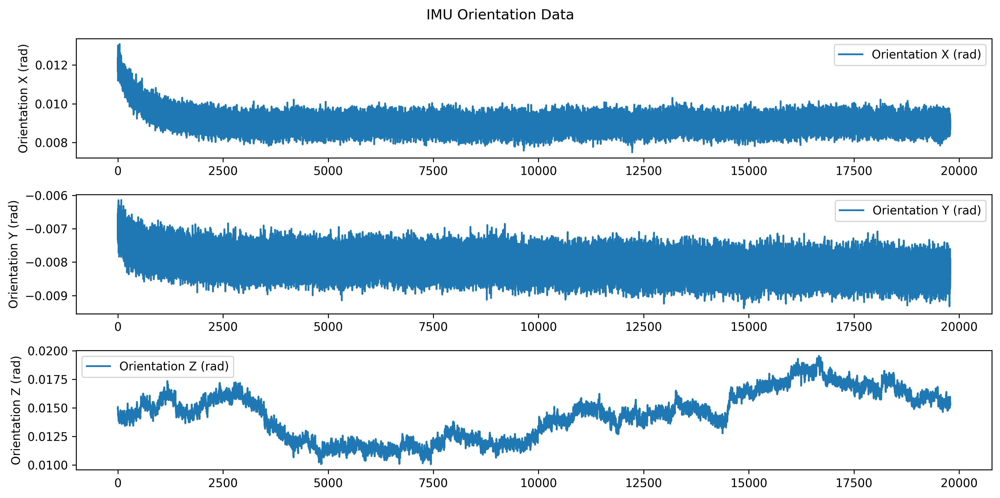

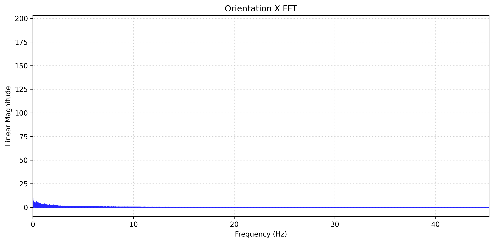

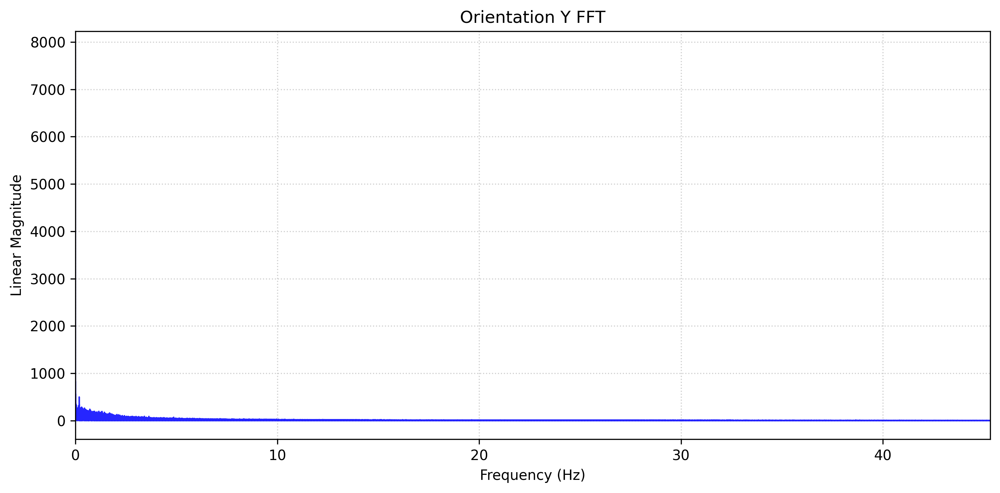

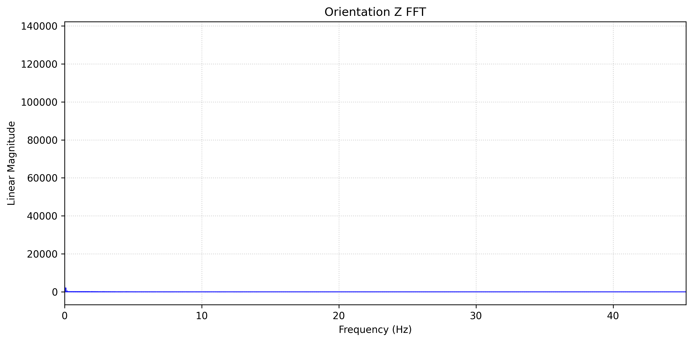
## Gyroscope Analysis

Gyroscope X Average: 0.00000001 (rad/s) Standard Deviation: 0.00001509

Gyroscope Y Average: 0.00000001 (rad/s) Standard Deviation: 0.00002606

Gyroscope Z Average: 0.00000000 (rad/s) Standard Deviation: 0.00001738

Gyroscope Covariance Matrix:
$$
\begin{bmatrix}
0.0000000002276092 & -0.0000000000399557 & 0.0000000000115389 \\
-0.0000000000399557 & 0.0000000006790660 & -0.0000000000792424 \\
0.0000000000115389 & -0.0000000000792424 & 0.0000000003020667 \\
\end{bmatrix}
$$

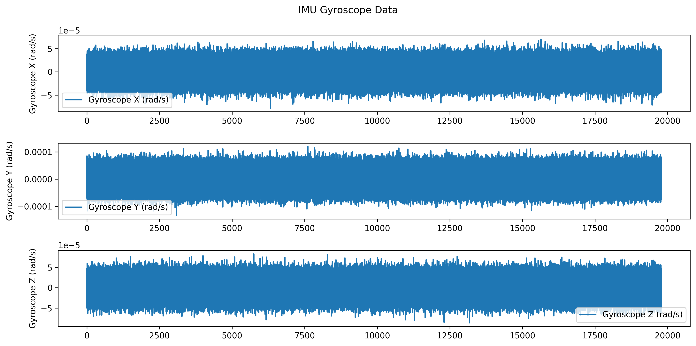

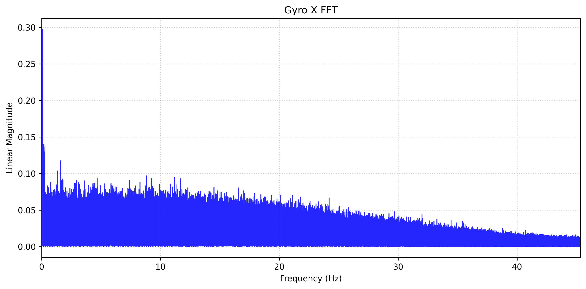

## Linear Acceleration Analysis

Linear Acceleration X Average: 0.07802175 (m/s^2) Standard Deviation: 0.00894493

Linear Acceleration Y Average: -0.08870406 (m/s^2) Standard Deviation: 0.01066008

Linear Acceleration Z Average: -9.75710712 (m/s^2) Standard Deviation: 0.00953738

Linear Acceleration Covariance Matrix:
$$
\begin{bmatrix}
0.0000800117458827 & 0.0000051904677181 & -0.0000009564654428 \\
0.0000051904677181 & 0.0001136374683443 & -0.0000021826754794 \\
-0.0000009564654428 & -0.0000021826754794 & 0.0000909615922895 \\
\end{bmatrix}
$$

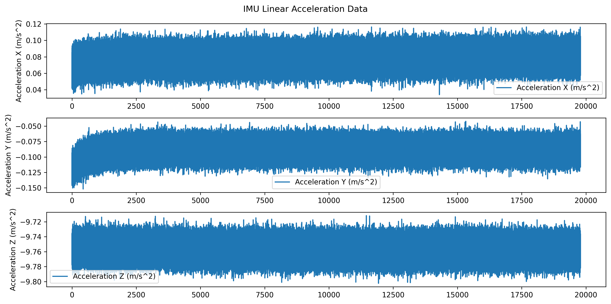

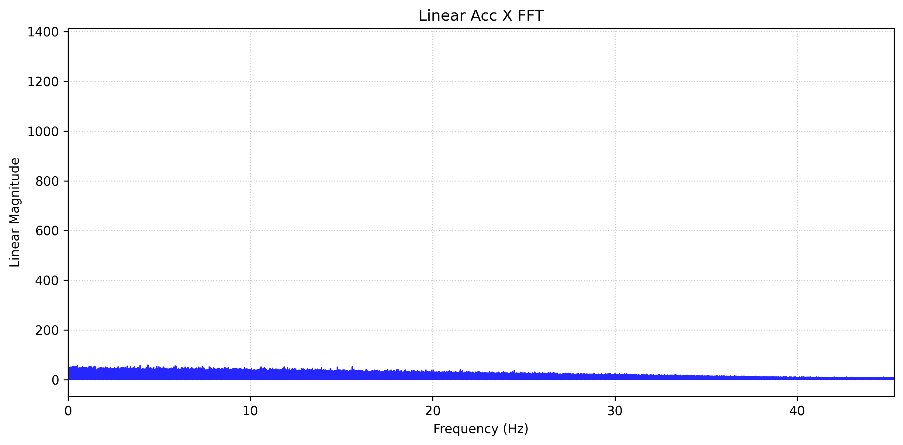

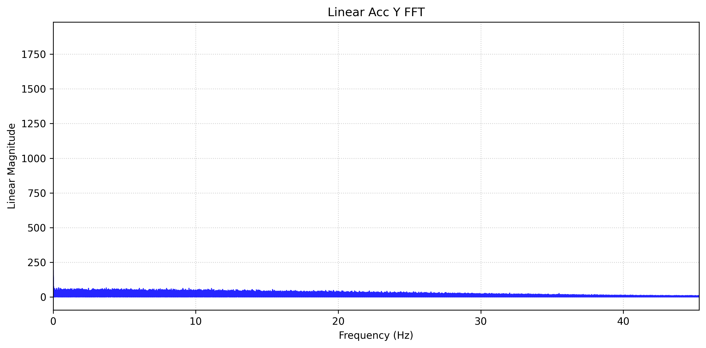

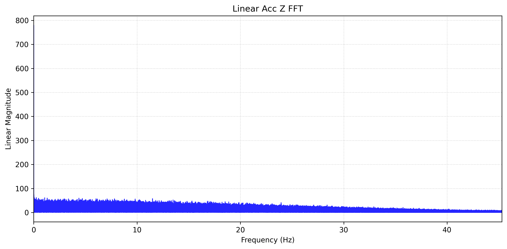
# IMU Magnetometer Analysis

Magnetic Data Message Count: 1793486

Magnetic Data Duration: 19787.71 seconds

Magnetic Data Average Frequency: 90.64 Hz
## Magnetometer Analysis

Magnetometer X Average: 0.00000127 (T) Standard Deviation: 0.00000010

Magnetometer Y Average: 0.00000966 (T) Standard Deviation: 0.00000011

Magnetometer Z Average: -0.00003948 (T) Standard Deviation: 0.00000019

Magnetometer Covariance Matrix:
$$
\begin{bmatrix}
0.0000000000000097 & -0.0000000000000006 & 0.0000000000000021 \\
-0.0000000000000006 & 0.0000000000000125 & -0.0000000000000087 \\
0.0000000000000021 & -0.0000000000000087 & 0.0000000000000372 \\
\end{bmatrix}
$$

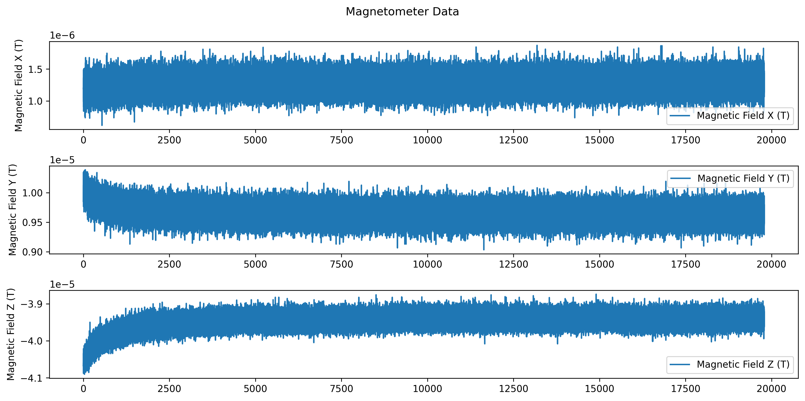

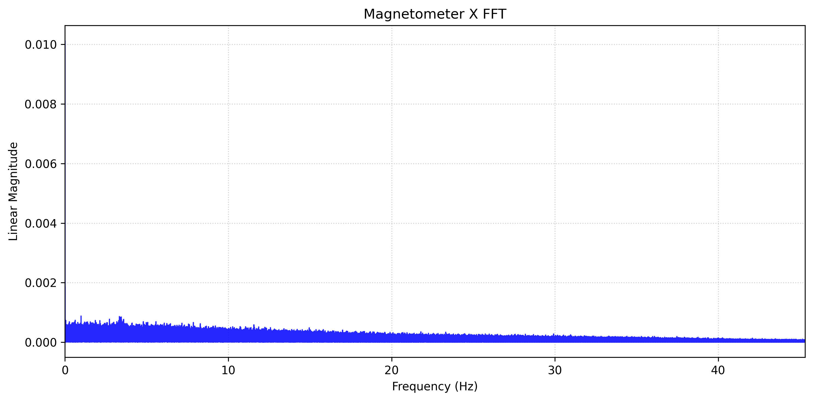

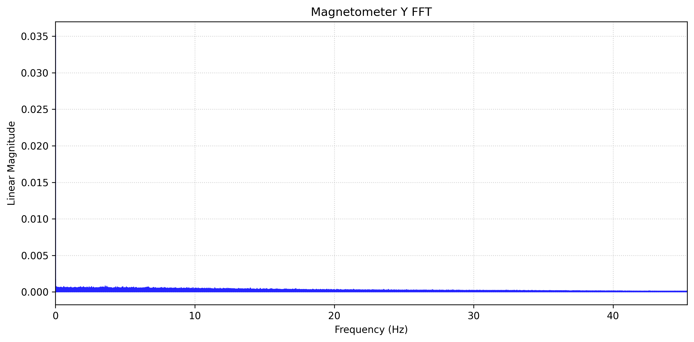

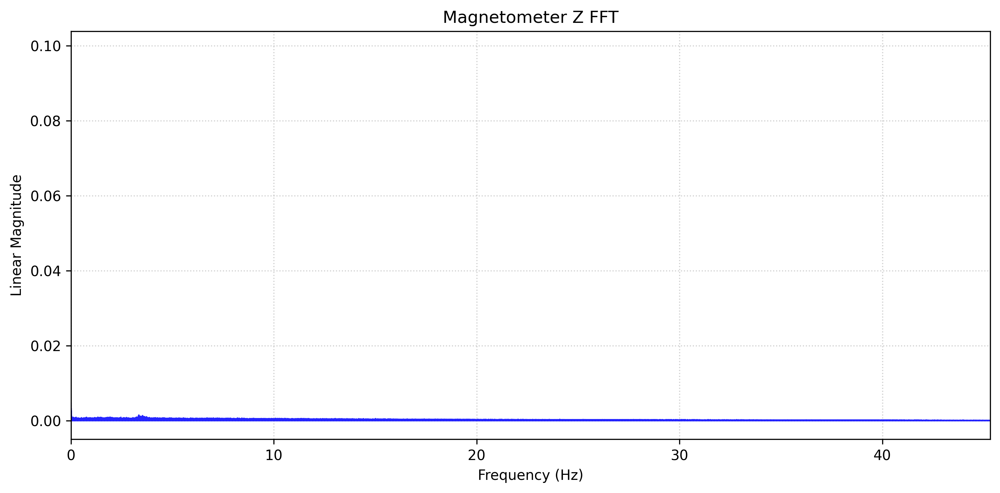